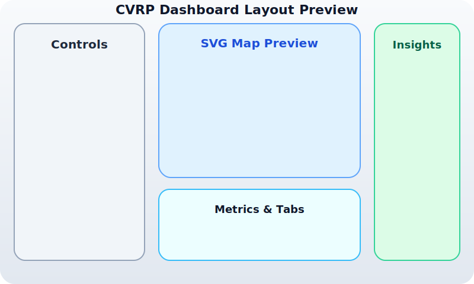

# CVRP Frontend Dashboard

A standalone Angular 15 dashboard for exploring Capacitated Vehicle Routing Problem (CVRP) scenarios. The UI renders seeded mock data with an SVG-based map, responsive controls, and analytics panels so it is ready to connect to a backend solver later on.



## Features

- **Controls sidebar** with dataset selection, vehicle configuration sliders, algorithm parameters, random seed input, and run/reset/export actions.
- **SVG route map** that draws depot, customers, and per-vehicle polylines with hover highlighting that syncs with the routes table.
- **Metrics panel** summarising distance, vehicle usage, violations, runtime, and gap.
- **Analysis tabs** for route details, convergence mock chart, and textual solver logs.
- **Seeded mock services** that generate deterministic datasets, simulate solver output, and compute aggregate metrics without any backend calls.
- **Export helpers** to download the solution as JSON or rasterise the SVG map as a PNG.

## Getting started

```bash
npm install
npm start
```

> ℹ️ If installing dependencies fails in restricted environments (e.g. `@angular/material` returning HTTP 403), configure npm to use a registry with access and re-run `npm install`.

Then open <http://localhost:4200>. Click **Run** to generate mock routes using the current configuration. Use the tabs beneath the metrics to inspect routes, compare convergence trends, or read the run log. Export buttons provide both JSON and PNG snapshots.

## Tech stack

- Angular 15 with standalone components and strict TypeScript
- Angular Material UI components styled with Tailwind CSS utility classes
- Deterministic mock data/simulation services (no backend)
- ESLint + Prettier ready configuration (via Angular CLI defaults)

## Project structure

```
src/app/
  core/
    models/             // Typed interfaces for depot, customer, routes, metrics
    services/           // MockDataService, SolverAdapterService, MetricsService, ExportService
    utils/              // Seeded RNG helpers and distance utilities
  features/
    controls-panel/     // Left-hand configuration form
    dashboard/          // Main layout container (sidenav + content)
    map-view/           // SVG map rendering
    metrics-cards/      // Summary cards component
    routes-tab/         // Vehicle cards + routes table
    compare-tab/        // Mock convergence/runtime charts
    run-log-tab/        // Textual log display
```

## Mock data behaviour

- Random datasets use a seeded RNG to keep results deterministic.
- Vehicle assignment respects capacity when possible and tracks violations otherwise.
- Convergence/runtime series are procedurally generated to emulate solver progress.
- A one-second artificial delay mimics asynchronous solver calls.

## Exporting

- **JSON** – full payload with configuration, instance, and solution metrics.
- **PNG** – rasterises the SVG map (1000×600 canvas) with a white background for sharing.

## Roadmap for backend integration

- Replace `SolverAdapterService` with API calls to the forthcoming Python solver.
- Stream real solver logs via WebSocket or polling.
- Swap the synthetic convergence/runtime data with real metrics.

---

Happy routing!
